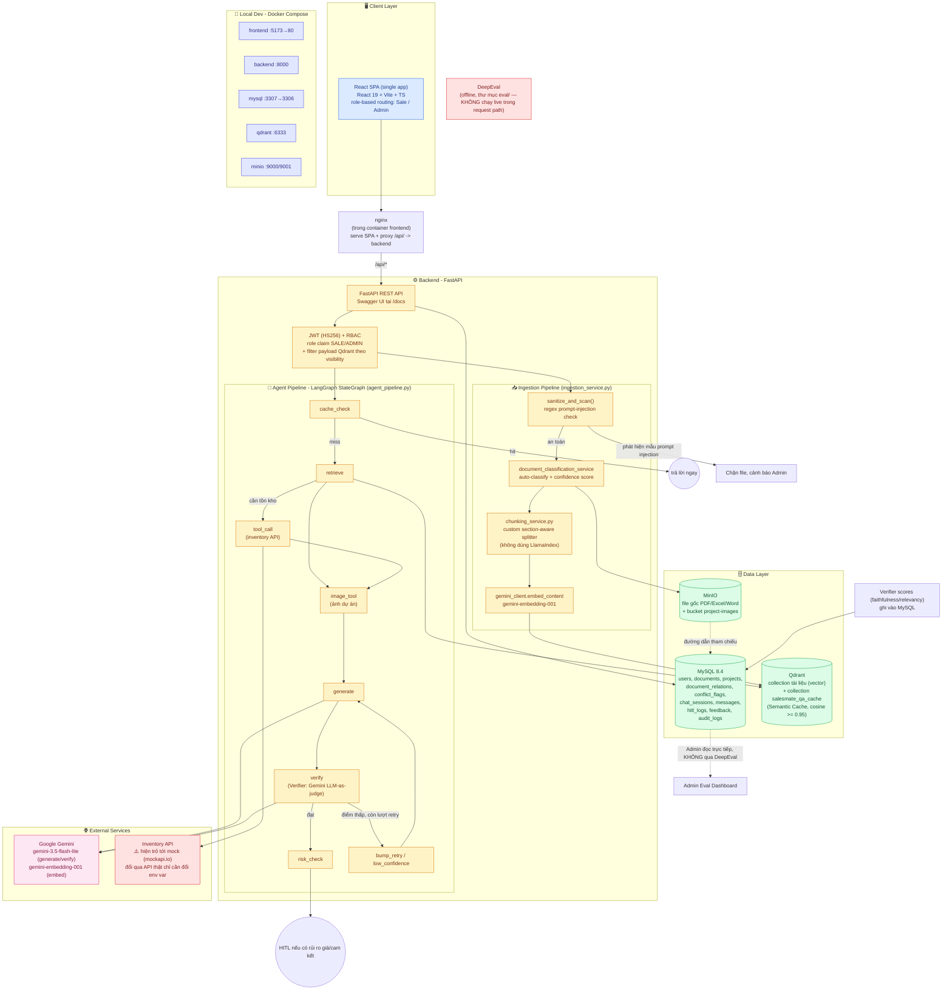
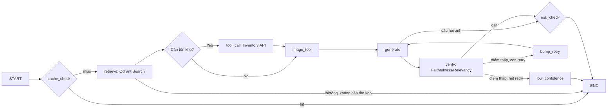
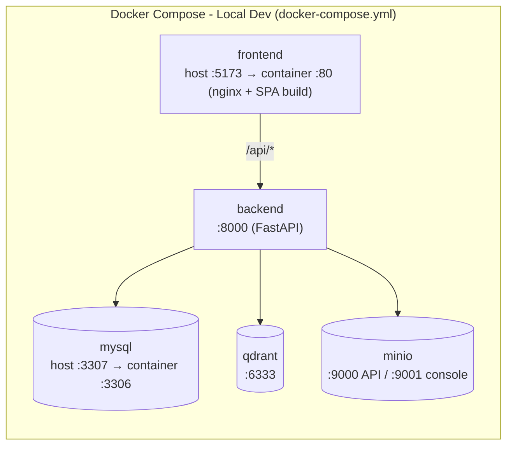

# Architecture Document

## System Overview

Auremont AI Agent là một ứng dụng RAG một-SPA-hai-vai-trò: một React SPA duy nhất phân nhánh giao diện Sale/Admin theo `role` trong JWT, một backend FastAPI điều phối pipeline trả lời qua LangGraph (cache → retrieve → tool-call tồn kho → generate → verify → risk-check), và ba kho dữ liệu tách biệt theo vai trò — MySQL (quan hệ/metadata), Qdrant (vector) và MinIO (file gốc). Toàn bộ hệ thống chạy bằng Docker Compose cho local dev; chưa có hạ tầng deploy production nào được cấu hình trong repo.

## Architecture Diagram

## Components

### 1. Frontend (React + Vite + TS)
- **Purpose:** Một SPA duy nhất (`frontend/`) phục vụ cả 2 vai trò — Sale (chat tư vấn, duyệt catalogue tồn kho) và Admin (quản lý kho tài liệu, giám sát chất lượng AI). Phân nhánh theo `role` đọc từ JWT ngay trong `App.tsx` (`ProtectedRoute allowedRole=...`), **không phải hai ứng dụng build/deploy riêng**.
- **Key Features:**
  - Sale: sidebar Session (chat), khung chat Text, trạng thái Loading theo bước xử lý, Thẻ HITL (`HitlCard.tsx`) bắt buộc xác nhận trước khi copy nội dung gửi khách, nút Feedback (`FeedbackButtons.tsx`) trên từng câu trả lời, dải ảnh minh họa (`AnswerImageStrip.tsx`), và khu vực duyệt catalogue tồn kho theo dự án/phân khu (`routes/sale/inventory/*`).
  - Admin: kéo-thả upload PDF/Excel, bảng danh sách tài liệu, tab Đánh giá AI (đọc điểm Verifier từ MySQL), tab Cảnh báo mâu thuẫn (`ConflictsTab.tsx`), tab Document Relations (`DocumentRelationsTab.tsx`), tab Duyệt phân loại tài liệu (`DocumentReviewTab.tsx`), Cài đặt chung.
  - Swagger UI (`/docs`) dùng nội bộ để dev/test API, không expose cho end-user.
- **State Management:** React Context (`context/AuthContext.tsx`, `context/ThemeContext.tsx`) + hooks (`hooks/useAuth.ts`) cho state cục bộ, gọi API trực tiếp qua `api/client.ts` (fetch thuần). **Không dùng Zustand hay TanStack Query** — bản thiết kế ban đầu đề xuất hai thư viện này nhưng chưa được đưa vào (`package.json` chỉ có `react`, `react-dom`, `react-router-dom`).

### 2. Backend (FastAPI)
- **Purpose:** Điều phối toàn bộ pipeline — nhận câu hỏi từ Sale, chạy Agent Pipeline, quản lý ingestion tài liệu từ Admin, cung cấp dữ liệu cho Dashboard đánh giá.
- **API Design:** RESTful, tự sinh docs qua Swagger UI tại `/docs`. Routers thực tế: `auth`, `users`, `projects`, `documents`, `document_relations`, `sale_chat`, `hitl`, `feedback`, `admin_conflicts`, `admin_eval`, `admin_stats`, `admin_settings`, `dev_seed` (chỉ dùng để seed dữ liệu E2E, không dùng production).
- **Authentication:** JWT (HS256, `python-jose`) với claim `role` (SALE/ADMIN) — đã triển khai thật, không còn là đề xuất (`backend/core/security.py`, `backend/routers/auth.py`). RBAC 2 lớp: chặn ở route (`require_role` trong `backend/core/deps.py`) và filter ở tầng retrieval (`rag_service._visibility_condition` lọc payload Qdrant theo `visibility`).
- **Reverse proxy:** nginx **không phải một service hạ tầng độc lập** — nó là web server bên trong Docker image của `frontend/` (`frontend/Dockerfile`, `frontend/nginx.conf`), phục vụ SPA đã build và proxy `/api/*` sang container backend.

### 3. Agent Pipeline (LangGraph `StateGraph`)
- **Kiến trúc thật:** Một `StateGraph` LangGraph duy nhất (`backend/services/agent_pipeline.py`), không phải nhiều "agent" độc lập theo đúng nghĩa Multi-Agent — chỉ có một model Gemini gọi 2 lần với 2 prompt khác nhau (generate và verify).
- **State (`PipelineState`):** `query, project_id, retrieved_docs, needs_inventory, needs_document_retrieval, inventory_units, inventory_failed, draft_answer, citations, verifier_score, faithfulness, answer_relevancy, requires_hitl, images, db, retry_count, notice, used_cache`.
- **9 nodes thật:**
  - `cache_check` — tra Semantic Cache (collection Qdrant riêng `salesmate_qa_cache`, ngưỡng cosine ≥ 0.95) trước khi tốn token.
  - `retrieve` — truy vấn Qdrant lấy context; xác định câu hỏi có cần tồn kho real-time không.
  - `tool_call` — gọi API tồn kho (hiện là mock `mockapi.io`, xem mục External Services).
  - `image_tool` — lấy ảnh minh họa dự án cho câu hỏi kiểu "cho xem mặt bằng/hình ảnh"; chạy **trước** `generate` để model biết ảnh sẽ đính kèm.
  - `generate` — sinh câu trả lời kèm trích nguồn (Gemini `gemini-3.5-flash-lite`).
  - `verify` — Verifier chấm Faithfulness/Relevancy độc lập (cũng bằng Gemini, LLM-as-judge, **không dùng DeepEval inline** vì DeepEval mặc định gọi OpenAI, chậm hơn).
  - `risk_check` — phát hiện rủi ro giá/cam kết trong câu trả lời, gắn cờ HITL.
  - `bump_retry` — tăng bộ đếm và quay lại `generate` (tối đa 1 lần retry khi điểm Verifier thấp).
  - `low_confidence` — node kết thúc khi hết lượt retry mà điểm vẫn thấp, trả về "Không đủ thông tin, liên hệ Admin".
- **Câu hỏi ảnh bỏ qua `verify`:** answer-relevancy chấm *văn bản* so với câu hỏi nên không thể chấm đúng khi câu trả lời là ảnh; `risk_check` vẫn chạy bình thường.
- **Tools:** `rag_service.retrieve` (Qdrant + rerank), `inventory_service.lookup_inventory` (API tồn kho), `answer_images_service.collect_images` (ảnh dự án), `citations.build_citations` (chuẩn hóa trích nguồn).
- **Re-ranker:** **không phải model cross-encoder riêng** — `rag_service._rerank` là một hàm keyword-overlap nhẹ (khớp token có chữ số như "2PN"/"OP3" giữa câu hỏi và kết quả, trộn 20% trọng số vào điểm vector), được comment rõ trong code là placeholder có thể thay bằng cross-encoder/Cohere Rerank sau này.
- **Flow:**

### 4. Database (MySQL 8.4 + SQLAlchemy + Alembic)
- **Migrations:** Alembic thật (`alembic.ini`, `migrations/versions/`, 10 migration files).
- **Bảng thật (`backend/models/*.py`):**
  - `users` — id, username, email, hashed_password, role, is_active, created_at.
  - `documents` — ~30 cột, gồm title, file_path (đường dẫn MinIO), visibility (internal/public), category/subcategory, review_status, classification_confidence, legal_document_type, legal_status, is_current, version_label, effective_date, uploaded_by, uploaded_at...
  - `projects` — id, name, location, description, details (JSON) — thực thể catalogue dự án, được tham chiếu bởi chat_sessions/documents/inventory mapping.
  - `document_relations` — liên kết tài liệu này thay thế/liên quan tài liệu khác (relation_type, confidence, review_status) — nguồn cho tab Document Relations, **khác** với `conflict_flags`.
  - `conflict_flags` — document_id_a, document_id_b, status, resolved_by, resolved_at — cờ mâu thuẫn nội dung giữa 2 tài liệu.
  - `chat_sessions` — phiên tư vấn theo sale/khách hàng.
  - `messages` — nội dung chat, citations, risk_flag, timestamp.
  - `hitl_logs` — nhật ký xác nhận HITL của Sale.
  - `feedback` — phản hồi đúng/sai của Sale trên từng câu trả lời.
  - `audit_logs` — nhật ký sự kiện nghiệp vụ (login/logout, xác nhận HITL...), phục vụ `/admin/eval/audit`.

### 5. Vector Store (Qdrant)
- **Type:** Qdrant self-host, chỉ lưu vector embedding — tách biệt hoàn toàn với MinIO.
- **Embedding model đã chốt (không còn là đề xuất mở):** `gemini-embedding-001` (768 chiều), gọi trực tiếp qua `google-genai` SDK (`backend/core/gemini_client.py`) — **không dùng LlamaIndex**. Chunking là code tự viết (`backend/services/chunking_service.py`): bộ tách theo cấu trúc văn bản (số La Mã, "ĐIỀU", "CHƯƠNG", heading breadcrumb, gom bảng/bullet).
- **2 collection:** một collection tài liệu chính, một collection Semantic Cache (`salesmate_qa_cache`) lưu câu hỏi đã trả lời đạt điểm Verifier để tái sử dụng.
- **Purpose:** RAG — truy hồi ngữ cảnh từ bảng giá, mặt bằng, chính sách, tiện ích đã ingest; hỗ trợ payload filter theo `visibility` để phục vụ RBAC.

### 6. Ingestion Pipeline (`backend/services/ingestion_service.py`)
- **Prompt Injection Scanner (`sanitize_and_scan`):** danh sách ~6 regex pattern cố định (ví dụ "ignore previous instructions", "system prompt", "jailbreak"...), chạy như một bước inline trong `ingest_uploaded_document`, **không phải một service/model quét riêng**.
- **Document Classification (`document_classification_service.py`):** bước AI tự động phân loại tài liệu kèm điểm tin cậy, có ngưỡng tự-duyệt cấu hình được (`classification_auto_approve_threshold`), đưa vào hàng chờ duyệt Admin (`review_status`, tab Document Review) — hoàn toàn chưa có trong bản thiết kế gốc.
- **Flow thật:** Admin upload → `sanitize_and_scan` → (an toàn) → lưu MinIO → `document_classification_service` (phân loại + confidence) → `chunking_service` (chunk) → `gemini_client.embed_content` (embed) → Qdrant.

### 7. Tính năng khác chưa có trong thiết kế gốc
- **Answer images / project gallery** (`backend/services/answer_images_service.py`, bucket MinIO `project-images`, biến môi trường `PROJECT_IMAGES_BASE_URL`/`PROJECT_IMAGES_ARCHIVE_URL`, frontend `AnswerImageStrip.tsx`) — Sale hỏi "cho xem mặt bằng/hình ảnh" sẽ nhận kèm ảnh thật từ catalogue.
- **Inventory catalogue browsing UI** (`frontend/src/routes/sale/inventory/*` — theo từng phân khu, ví dụ `the-metropolitan.tsx`, `tieu-khu-hai-au.tsx`) — khu vực duyệt tồn kho dạng catalogue ngoài luồng chat.

## Data Flow
1. Sale gửi câu hỏi (Text) từ Frontend.
2. FastAPI route nhận request, validate input bằng Pydantic, xác thực JWT + kiểm tra Role.
3. `cache_check` tra Semantic Cache (Qdrant, cosine ≥ 0.95) — trùng câu hỏi đã cache thì trả ngay, bỏ qua các bước dưới.
4. Cache miss: `retrieve` truy vấn Qdrant lấy context (áp payload filter theo `visibility`); nếu câu hỏi cần dữ liệu tồn kho, `tool_call` gọi API tồn kho (hiện là mock mockapi.io).
5. `image_tool` lấy ảnh dự án nếu câu hỏi hỏi hình ảnh/mặt bằng.
6. `generate` — Gemini (`gemini-3.5-flash-lite`) sinh câu trả lời kèm trích nguồn tài liệu.
7. `verify` — Verifier (cũng Gemini, LLM-as-judge) chấm điểm Faithfulness/Relevance; điểm thấp → tối đa 1 lần quay lại `generate`; hết lượt vẫn thấp → "Không đủ thông tin, liên hệ Admin". Câu hỏi dạng ảnh bỏ qua bước này.
8. `risk_check` — nếu câu trả lời chạm rủi ro cam kết/giá → gắn cờ HITL, Sale phải xác nhận (`hitl_logs` ghi nhận) mới được copy gửi khách.
9. Response trả về Frontend kèm nút Feedback; điểm Verifier được ghi thẳng vào MySQL để Admin Eval Dashboard đọc trực tiếp — **không qua DeepEval** (DeepEval chỉ dùng offline, thư mục `eval/`, không nằm trong request path).

## Deployment Architecture (local dev — Docker Compose)

> **Production hosting (Vercel/Fly.io) chưa được triển khai.** Không có `vercel.json`, `fly.toml`, hay bước deploy nào trong `.github/workflows/ci.yml` (hiện chỉ chạy `ruff` lint + `pytest` trên self-hosted runner). Docker Compose là đường chạy thực tế duy nhất hiện có trong repo; Vercel/Fly.io vẫn là định hướng tương lai, không phải hiện trạng.

## Security
- API keys (Gemini, MinIO, DB, JWT secret) lưu trong `.env`, không commit (`.env.example` làm mẫu).
- Input validation qua Pydantic ở mọi endpoint.
- CORS cấu hình qua `cors_origins` (mặc định `http://localhost:3000,http://localhost:5173`), không gắn cứng theo domain Vercel.
- RBAC 2 lớp: chặn ở route (role SALE/ADMIN qua `require_role`) và filter ở tầng retrieval (payload Qdrant theo `visibility`) để phân biệt tài liệu nội bộ/công khai.
- Prompt Injection scanning (regex pattern list) bắt buộc khi ingest tài liệu — chặn file trước khi vào MinIO/Qdrant.
- HITL bắt buộc cho mọi câu trả lời có rủi ro cam kết/giá, có nhật ký xác nhận (`hitl_logs`) — lớp bảo vệ nghiệp vụ, không chỉ kỹ thuật.
- **Rate limiting: chưa triển khai.** Không có middleware/thư viện rate limiting nào trong `backend/` hiện tại — đây là hạng mục còn thiếu, không phải đã có như thiết kế ban đầu mô tả.

## Design Decisions
| Decision | Choice | Reason |
|----------|--------|--------|
| Framework | FastAPI | Async, auto-docs (Swagger UI), type-safe, phù hợp pipeline nhiều bước |
| Agent orchestration | LangGraph `StateGraph` (1 graph, 9 node) | Quản lý state linh hoạt, dễ thêm vòng lặp retry khi Verifier chấm điểm thấp; không cần nhiều "agent" tách rời để đạt được vòng lặp tự sửa lỗi |
| Database | MySQL 8.4 + Alembic | Quan hệ rõ ràng giữa Users/Documents/Projects/Sessions/Feedback, dễ join cho Admin dashboard |
| Frontend | React + Vite (1 SPA, không SSR) | Internal tool yêu cầu đăng nhập, không cần SSR/SEO; 1 SPA phân nhánh role đơn giản hơn duy trì 2 app |
| Vector Store | Qdrant | Self-host đáp ứng yêu cầu bảo mật enterprise, hỗ trợ payload filtering cho RBAC tài liệu |
| Object Storage | MinIO | S3-compatible, tách file gốc khỏi vector DB, dùng để tải lại/tham chiếu khi cần |
| Embedding | `gemini-embedding-001` (768d), gọi trực tiếp qua `google-genai` | Đồng bộ hệ sinh thái Gemini đang dùng cho generation, không cần thêm abstraction layer như LlamaIndex |
| Generation/Verify LLM | Gemini `gemini-3.5-flash-lite` (chỉ 1 provider) | Chi phí/độ trễ thấp, đủ cho ngân sách phản hồi dưới 3 giây; Claude/GPT-4o trong thiết kế gốc chưa được tích hợp |
| Re-rank | Keyword-overlap heuristic (không phải cross-encoder) | Đơn giản, không thêm dependency, đủ dùng cho các câu hỏi số phòng/mã căn; có thể thay bằng cross-encoder/Cohere Rerank sau |
| Eval | Verifier score ghi trực tiếp MySQL, đọc trực tiếp cho Admin dashboard; DeepEval dùng offline riêng trong `eval/` | DeepEval mặc định gọi OpenAI nên chậm hơn ngân sách phản hồi real-time; tách biệt eval offline khỏi eval online giúp dashboard nhanh và không phụ thuộc thêm provider |
| Inventory integration | Mock API (`mockapi.io`) qua biến môi trường `INVENTORY_API_URL` | Chưa có API tồn kho nội bộ thật trong giai đoạn build; đổi sang API thật chỉ cần đổi env var, không cần sửa code |
| Deploy | Docker Compose (local); Vercel/Fly.io chưa triển khai | Ưu tiên chạy được end-to-end cục bộ trước; hạ tầng production để sau |
