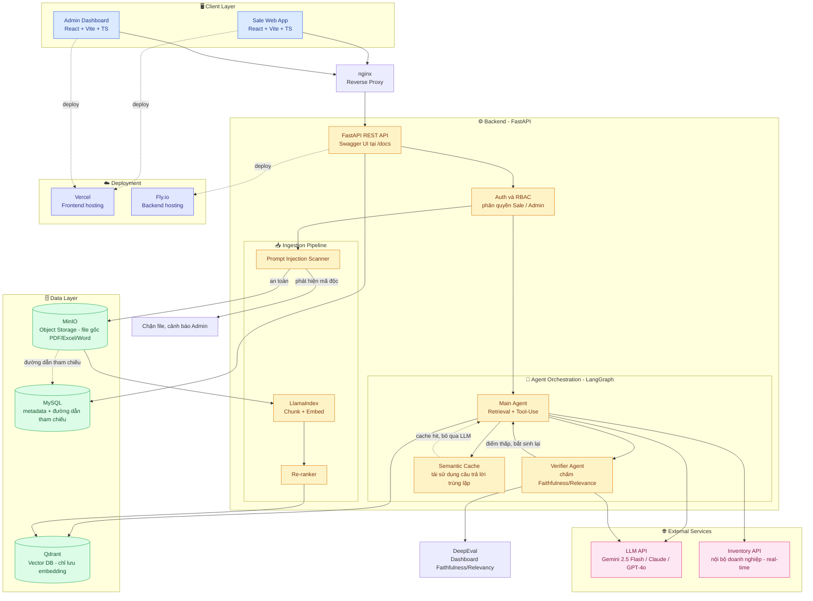
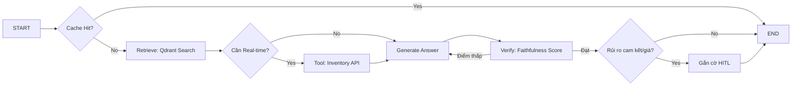
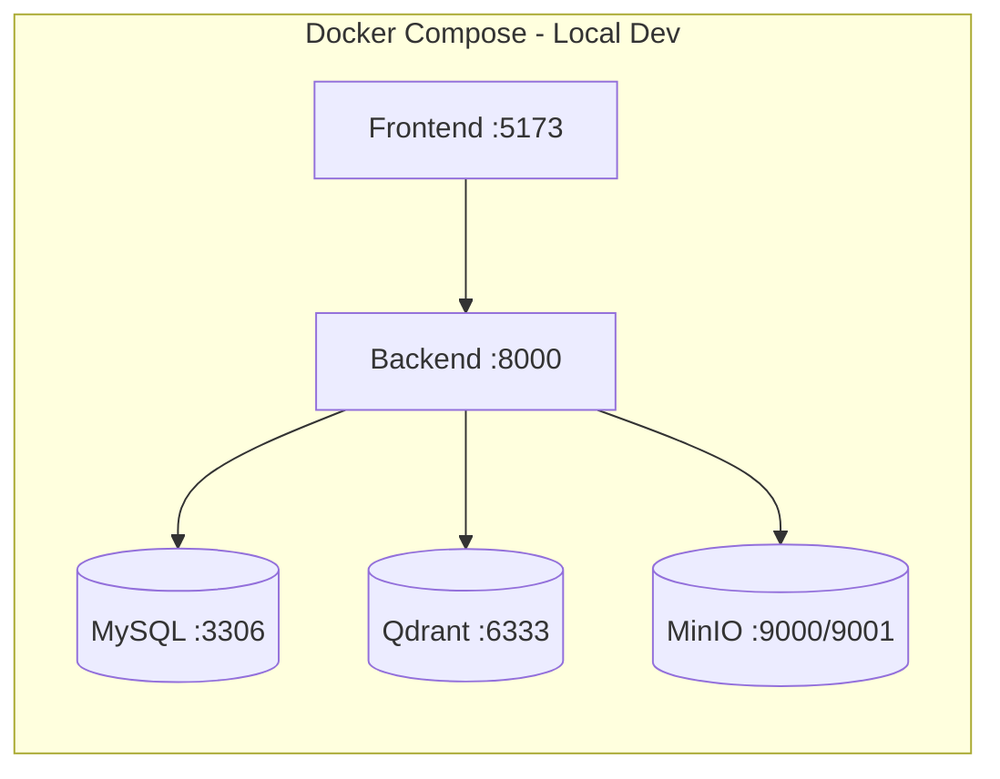

# Architecture Document

## System Overview

[Tóm tắt 2-3 câu về kiến trúc hệ thống]

## Architecture Diagram

## Components
 
### 1. Frontend (React + Vite)
- **Purpose:** Giao diện web cho 2 vai trò — Sale (chat tư vấn tức thời) và Admin (quản lý kho tài liệu, giám sát chất lượng AI). Phân nhánh hoàn toàn theo Role ngay từ màn hình đăng nhập.
- **Key Features:**
  - Sale: sidebar Session (giống ChatGPT), khung chat Text/Voice, trạng thái Loading theo bước xử lý, Thẻ HITL bắt buộc xác nhận trước khi copy nội dung gửi khách, nút Feedback trên từng câu trả lời.
  - Admin: kéo-thả upload PDF/Excel, bảng danh sách tài liệu (Tên file/Trạng thái/Phân quyền/Xóa), Dashboard điểm DeepEval, danh sách câu hỏi AI trả lời thất bại, Flag mâu thuẫn tài liệu với hành động Xóa cũ/Ưu tiên mới.
  - Swagger UI (`/docs`) dùng nội bộ để dev/test API, không expose cho end-user.
- **State Management:** Zustand cho state cục bộ (session hiện tại, danh sách message, trạng thái Loading/HITL) kết hợp TanStack Query cho server state (fetch tài liệu, tồn kho, lịch sử session) để tận dụng cache/refetch tự động — phù hợp với yêu cầu phản hồi dưới 3 giây.
### 2. Backend (FastAPI)
- **Purpose:** Điều phối toàn bộ pipeline — nhận câu hỏi từ Sale, gọi Agent xử lý, quản lý ingestion tài liệu từ Admin, cung cấp dữ liệu cho Dashboard đánh giá.
- **API Design:** RESTful, tự sinh docs qua Swagger UI tại `/docs`.
- **Authentication:** *(đề xuất)* JWT kèm claim `role` (SALE/ADMIN) — RBAC không chỉ chặn ở route mà còn filter ở tầng retrieval (payload filter trong Qdrant) để phân biệt tài liệu nội bộ vs công khai.
### 3. AI Agent (LangGraph)
- **Agent Type:** Multi-Agent tùy biến — Main Agent theo mô hình ReAct (reason → tool-call → observe → answer) kết hợp Verifier Agent độc lập chạy sau để chấm điểm, tạo vòng lặp tự sửa lỗi.
- **State:** `{ session_id, messages[], retrieved_docs[], needs_realtime: bool, inventory_data, verifier_score, risk_flag: bool, retry_count }`
- **Nodes:**
  - `CacheCheck` — tra Semantic Cache trước khi tốn token.
  - `Retrieve` — truy vấn Qdrant lấy context liên quan.
  - `ToolCall` — gọi API tồn kho real-time khi câu hỏi cần dữ liệu động.
  - `Generate` — sinh câu trả lời kèm trích nguồn.
  - `Verify` — Verifier Agent chấm Faithfulness/Relevance.
  - `RiskCheck` — đánh giá câu trả lời có chạm giá/cam kết không, quyết định gắn cờ HITL.
- **Tools:** `vector_search_tool` (query Qdrant), `inventory_api_tool` (gọi API tồn kho nội bộ), `citation_formatter` (chuẩn hóa trích nguồn + ảnh mặt bằng đính kèm).
- **Flow:**

 
### 4. Database
- **Type:** MySQL.
- **Tables:** 
  - `users` (id, role, permissions)
  - `documents` (id, filename, status, permission_level, minio_path, uploaded_by, uploaded_at)
  - `document_conflicts` (doc_id_1, doc_id_2, status, resolved_by)
  - `sessions` (id, sale_id, customer_name, created_at)
  - `chat_messages` (id, session_id, role, content, citations, risk_flag, timestamp)
  - `feedback` (id, message_id, type, comment, created_at)
- **Migrations:** Alembic.
### 5. Vector Store
- **Type:** Qdrant (self-host, chỉ lưu vector embedding — không lưu file gốc, tách biệt hoàn toàn với MinIO).
- **Embeddings:** *(chưa chốt trong CLAUDE.md — đề xuất)* `text-embedding-004` (đồng bộ hệ sinh thái Gemini đang dùng cho generation) hoặc `multilingual-e5-large` nếu ưu tiên chất lượng tiếng Việt cho văn bản pháp lý/chính sách bán hàng — cùng hướng lựa chọn từng dùng ở RegWatch.
- **Purpose:** RAG — truy hồi ngữ cảnh từ bảng giá, mặt bằng, chính sách, tiện ích đã ingest; hỗ trợ payload filter theo `permission_level` để phục vụ RBAC.
## Data Flow
1. Sale gửi câu hỏi (Text/Voice) từ Frontend.
2. FastAPI route nhận request, validate input bằng Pydantic, xác thực JWT + kiểm tra Role.
3. Main Agent kiểm tra Semantic Cache — trùng câu hỏi đã cache thì trả ngay, bỏ qua các bước dưới.
4. Cache miss: Agent truy vấn Qdrant lấy context; nếu câu hỏi cần dữ liệu tồn kho, gọi Tool tới API real-time.
5. LLM (Gemini 2.5 Flash / Claude / GPT-4o) sinh câu trả lời kèm trích nguồn tài liệu.
6. Verifier Agent chấm điểm Faithfulness/Relevance; điểm thấp → bắt Main Agent sinh lại (quay về bước 5).
7. Nếu câu trả lời chạm rủi ro cam kết/giá → gắn cờ HITL, Sale phải xác nhận mới được copy gửi khách.
8. Response trả về Frontend kèm nút Feedback để Admin theo dõi chất lượng.
## Deployment Architecture

## Security
- API keys (LLM, MinIO, DB) lưu trong `.env`, không commit.
- Input validation qua Pydantic ở mọi endpoint.
- Rate limiting trên API endpoint, đặc biệt endpoint chat để tránh spam gọi LLM tốn chi phí.
- CORS cấu hình riêng cho domain frontend (Vercel).
- RBAC 2 lớp: chặn ở route (role SALE/ADMIN) và filter ở tầng retrieval (payload Qdrant) để phân biệt tài liệu nội bộ/công khai.
- Prompt Injection scanning bắt buộc khi ingest tài liệu — chặn file trước khi vào MinIO/Qdrant.
- HITL bắt buộc cho mọi câu trả lời có rủi ro cam kết/giá — lớp bảo vệ nghiệp vụ, không chỉ kỹ thuật.
## Design Decisions
| Decision | Choice | Reason |
|----------|--------|--------|
| Framework | FastAPI | Async, auto-docs (Swagger UI), type-safe, phù hợp pipeline nhiều tầng agent |
| Agent | LangGraph | Quản lý state linh hoạt cho Multi-Agent (Main + Verifier), dễ thêm vòng lặp retry khi Verifier chấm điểm thấp |
| Database | MySQL | Quan hệ rõ ràng giữa Users/Documents/Sessions/Feedback, dễ join cho Admin dashboard, team đã quen thuộc |
| Frontend | React + Vite (thay Next.js) | Đây là internal tool yêu cầu đăng nhập, không cần SSR/SEO; Vite cho dev/build nhanh hơn |
| Vector Store | Qdrant | Self-host đáp ứng yêu cầu bảo mật enterprise, hỗ trợ payload filtering cho RBAC tài liệu |
| Object Storage | MinIO | S3-compatible, tách file gốc khỏi vector DB, dùng để tải lại/tham chiếu khi cần |
 
