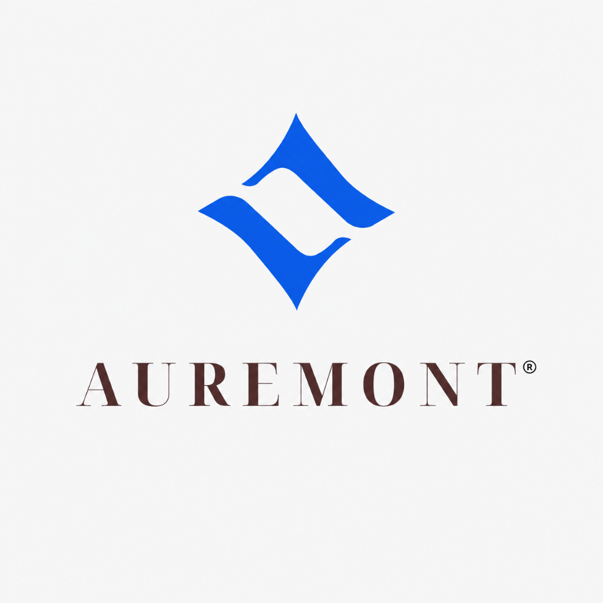
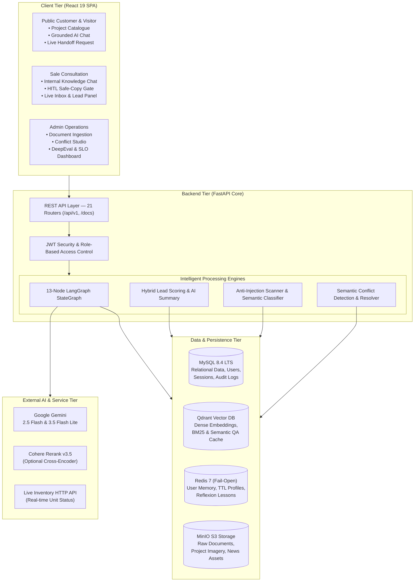
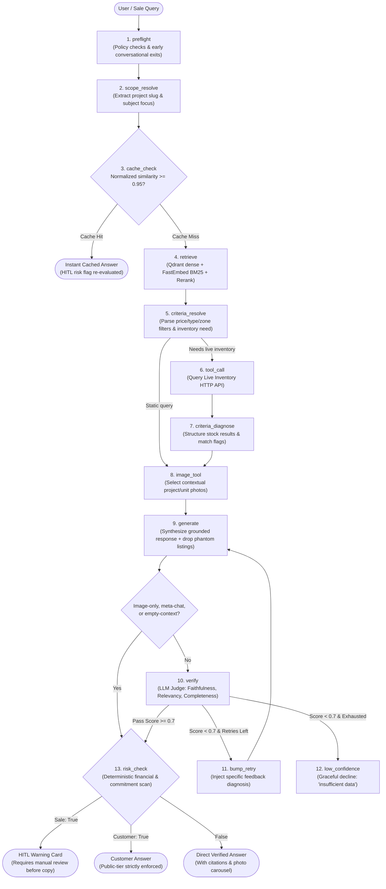

<div align="center">



### **AUREMONT AI AGENT**
**Enterprise Real-Estate AI Sales & Consultation Platform**

*13-Node LangGraph Pipeline • Grounded Hybrid RAG • Real-Time Inventory HTTP Tool • Self-Reflecting Verifier • Deterministic HITL Risk Gate • AI ↔ Human Live Handoff • Semantic Conflict Studio*

---

[](https://www.python.org/)
[](https://fastapi.tiangolo.com/)
[](https://react.dev/)
[](https://langchain-ai.github.io/langgraph/)
[](https://ai.google.dev/)
[](https://qdrant.tech/)
[](https://redis.io/)
[](https://www.mysql.com/)
[](https://min.io/)
[](https://www.docker.com/)
[](https://confident-ai.com/)
[](https://prometheus.io/)

</div>

---

## 📌 Executive Overview

### The Real Estate Sales Challenge
High-value real-estate transactions demand extreme speed, absolute accuracy, and strict legal compliance:
- **Massive & Fragmented Documentation**: Hundreds of pages of project prospectuses, complex milestone payment schedules, zoning legalities, and shifting discount policies across disparate PDF, DOCX, and XLSX files.
- **Critical Consequence of Hallucination**: Quoting an outdated discount tier, inaccurate base price, or invalid payment policy leads directly to customer disputes, brand erosion, and binding financial liability.
- **Dynamic Inventory Churn**: Unit availability shifts second-by-second on live transactional databases — static vector RAG risks recommending units that are already reserved or sold.
- **Document Policy Clashes**: New sales policies frequently supersede older releases without clean deprecation markers, creating silent discrepancies between concurrent documents.
- **Latency vs. Safety Tradeoff**: Sales reps in the field need instantaneous, grounded consultation while ensuring zero unverified financial commitments slip into client messaging.

### The Auremont Solution
**Auremont** is an enterprise-grade AI assistant and operations platform built specifically for real-estate sales enablement and customer consultation. Powered by an asynchronous **13-node LangGraph StateGraph**, Auremont unifies:
1. **Grounded Hybrid RAG & Real-Time Tool Calling**: Dense vector embeddings + FastEmbed BM25 + Cohere Reranking paired with a live HTTP inventory API.
2. **Self-Reflecting Verifier & Reflexion Memory**: Dual-pass evaluation judging Faithfulness, Relevancy, and Completeness, with targeted re-generation and persistent lesson learning in Redis.
3. **Deterministic Human-in-the-Loop (HITL) Safety Gate**: Zero-overhead regex engine intercepting high-risk monetary figures, payment pledges, and legal terms before sales reps can copy responses.
4. **AI ↔ Human-Sale Live Handoff & Hybrid Lead Scoring**: Seamless customer chat transition to live sales consultants, reinforced with automated Lead Scoring (Hot/Warm/Cold) and private AI customer profiles.
5. **Document Ingestion & Semantic Conflict Studio**: Automated anti-injection sanitation, multi-section categorization, and cross-document discrepancy detection with one-click administrative resolution.

---

## 🏗 System Architecture & Pipeline

Auremont separates client interactions into role-tailored interfaces, supported by a FastAPI backend coordinating a 13-node LangGraph agent, 4 specialized data stores, and task-tiered LLM routing:

### 1. High-Level System Architecture



---

### 2. 13-Node LangGraph Agent Execution Graph

Every query dispatched to the AI agent executes through an asynchronous, stateful LangGraph pipeline:



---

## 🌟 Key Capabilities & Technical Highlights

### 1. 🛡️ Self-Reflecting Verifier & Reflexion Self-Correction Loop
- **Multi-Axis Second-Pass Judge**: Eligible drafts are critiqued in an isolated verification call scoring **Faithfulness** (grounded in context), **Answer Relevancy** (answers user prompt), and **Completeness** (addresses all constraints).
- **Targeted Reflexion Retries (`MAX_GENERATE_RETRIES=1`)**: When a draft scores below threshold ($\tau = 0.7$), the verifier's exact diagnostic critique (e.g., *"Missing installment schedule for phase 2"*) is injected into the prompt for an immediate, self-corrected regeneration.
- **Reflexion Memory**: Recurring defects are distilled into durable lessons in Redis (`reflection:lessons`) to prevent identical future failures across sessions.
- **Hallucination Guardrails**: Deterministic post-processing (`_drop_figureless_listings`) strips hallucinated property listing cards lacking valid numeric area and pricing.

### 2. ⚡ Deterministic Human-in-the-Loop (HITL) Safety Gate
- **Zero-Latency Risk Engine**: A conservative, deterministic regex classifier evaluates responses with zero LLM overhead for financial units (`tỷ`, `triệu`, `VND`), numbers with $\ge 9$ digits, percentages, and binding legal language (`đặt cọc`, `cam kết`, `hợp đồng`, `sổ hồng`).
- **Sale Confirmation Guard**: When `requires_hitl = True`, the answer is locked inside an amber warning card in the Sale workspace. The sales rep must review and click **Confirm** before unlocking the quick-copy action.

### 3. 🛠️ Live Inventory HTTP Tool with Intelligent Slug Mapping
- Real-time stock queries (*"Còn căn 2PN nào ở Zenpark không?"*) trigger an HTTP call to the live inventory API instead of hallucinating from static embeddings.
- **Slug Normalization**: `INVENTORY_PROJECT_MAP` maps marketing project slugs to inventory system IDs with comma-separated pairs and a wildcard fallback (`*=code`).
- **Graceful Fallbacks**: Distinct handling for zero inventory (*"All 2BR units are currently reserved"*) versus API connection failures (*"Temporary inventory lookup timeout"*).

### 4. 👥 Tri-Tier Role Architecture (Customer, Sale, Admin)
- **Public Customer Flow**: Anonymous visitors (via `visitor_token`) and registered customers explore public project catalogues and consult the AI. Features daily turn/question budgets to curb token exhaustion and strict server-side retrieval filtering to `PUBLIC` documents.
- **Sale Consultation Workspace**: Sales representatives query internal pricing, commission structures, and unreleased policies (`INTERNAL` clearance) with rich chat suggestions, session history, and the HITL safe-copy card.
- **Admin Management Studio**: Full administrative power over document ingestion, conflict resolution, sales team performance, B2B billing requests, and real-time observability.

### 5. 🔄 AI ↔ Human-Sale Live Handoff & Hybrid Lead Scoring
- **Automated Handoff Detection**: Analyzes customer conversation for explicit handoff intent (*"Tôi muốn gặp nhân viên tư vấn"*, *"Gọi điện cho tôi"*), instantly transitioning the session into the `WAITING_SALE` queue on `/live-inbox`.
- **Hybrid Lead Scoring**: Combines heuristic behavioral signals with an LLM evaluation scoring customer buying readiness (Hot $\ge 65$, Warm $\ge 35$, Cold $< 35$).
- **Private AI Lead Summary**: Synthesizes customer requirements, budget, preferred units, and key questions into a private context briefing visible only to the sales rep before claiming the chat.

### 6. 📑 Enterprise Document Governance & Semantic Conflict Studio
- **Anti-Prompt-Injection Scanner**: Scans incoming PDF, DOCX, and XLSX files for prompt hijacking attempts and quarantines exact duplicate uploads before indexing.
- **Multi-Section Auto-Classification**: LLM-driven categorization into Legal, Price List, Payment Schedule, and General categories, automatically synchronizing metadata tags with Qdrant payloads.
- **Semantic Conflict Detection**: Compares newly uploaded policies against existing active documents, identifying price clashes, differing discount conditions, or policy contradictions with automated severity scoring.
- **Administrative Conflict Resolution**: Admins can approve document supersedence (`REPLACES`/`SUPERSEDES`/`REPEALS`), maintain conditional co-existence, or archive deprecated materials with two-phase lock-and-commit transactional integrity.

### 7. 🎯 Task-Tiered LLM Routing & Cost Management
To maximize performance while preventing free-tier quota starvation, Auremont splits LLM workloads across specialized models:
- **`gemini-2.5-flash` (Accurate Tier)**: Powers high-stakes, user-facing answer generation where natural prose, tone, and deep reasoning are paramount.
- **`gemini-3.5-flash-lite` (Fast Tier)**: Executes latency-sensitive checks inside the customer turn budget, including second-pass verification, intent classification, and lead scoring.
- **`gemini-3.5-flash-lite` (Background Tier)**: Handles asynchronous document categorization, semantic conflict comparison, and customer profile summarization without consuming answer generation quota.

---

## 🛠️ Technology Stack

| Layer | Technology | Purpose |
| :--- | :--- | :--- |
| **Backend Core** | FastAPI • Python 3.11 • Pydantic v2 | High-throughput asynchronous REST API, OpenAPI specifications, dependency injection |
| **Orchestration** | LangGraph (`StateGraph`) | 13-node stateful workflow with conditional branching and self-correction loops |
| **LLM Models** | Google Gemini (`gemini-2.5-flash`, `gemini-3.5-flash-lite`) | Task-tiered answer generation, fast verification, and background document analysis |
| **Embeddings** | Google Gemini (`gemini-embedding-001`, 768-dim) | High-fidelity dense vector representations for semantic retrieval |
| **Hybrid Search** | Qdrant • FastEmbed BM25 • Cohere Rerank v3.5 | Hybrid Reciprocal Rank Fusion (RRF) with optional cross-encoder reranking |
| **Vector DB & Cache** | Qdrant | Dense/sparse vector store, payload role filtering, and normalized Semantic QA Cache |
| **Relational Database** | MySQL 8.4 LTS • SQLAlchemy 2.0 • Alembic | Transactional storage for users, chat sessions, messages, and audit trail records |
| **Memory & Cache** | Redis 7 Alpine *(AOF persistence, fail-open)* | User personalization profiles, TTL-backed search criteria, and Reflexion memory |
| **Object Storage** | MinIO (S3-compatible) | Secure repository for raw document uploads, project imagery, and news media |
| **Frontend SPA** | React 19 • Vite • TypeScript • Vanilla CSS | Modern responsive UI with dynamic canvas background, particles, and role portals |
| **Observability & SLO** | Prometheus Client • Health Probes (`/health/live`, `/health/ready`) | Production metrics, 30-day SLO latency/availability tracking, and error budgets |
| **Quality Evaluation** | DeepEval • Golden Regression Gate • Pytest | Continuous regression testing across 13+ real-world sales scenarios |

---

## 🌐 Infrastructure & Ports

Production readiness probes and metrics are exposed at `/health/live`, `/health/ready`, and `/metrics`. Reliability targets, PromQL definitions, and error budget policies are detailed in [SLO.md](SLO.md).

| Service | Container Name | Host Port | Internal Docker URL | Purpose / Direct URL |
| :--- | :--- | :--- | :--- | :--- |
| **Frontend UI** | `ai20k_frontend` | `5173` | `http://frontend:80` | React 19 Client UI (`http://localhost:5173`) |
| **Backend API** | `ai20k_backend` | `8000` | `http://backend:8000` | FastAPI REST API & Swagger (`http://localhost:8000/docs`) |
| **MySQL** | `ai20k_mysql` | `3307` | `mysql:3306` | MySQL 8.4 Relational Database |
| **Qdrant** | `ai20k_qdrant` | `6333` | `http://qdrant:6333` | Vector Search & Dashboard (`http://localhost:6333/dashboard`) |
| **Redis** | `ai20k_redis` | `6379` | `redis://redis:6379/0` | Memory, Search Criteria & Reflexion Cache |
| **MinIO API** | `ai20k_minio` | `9000` | `http://minio:9000` | S3-Compatible Object Storage API |
| **MinIO Console** | `ai20k_minio` | `9001` | `http://minio:9001` | MinIO Web Management Console (`http://localhost:9001`) |

---

## 🚀 Quick Start Guide

### Prerequisites
- [Docker Desktop](https://www.docker.com/products/docker-desktop/) (recommended for containerized execution)
- [Node.js](https://nodejs.org/) 20.19+ and [Python](https://www.python.org/) 3.11+ (for local host process development)
- A valid [Google Gemini API Key](https://aistudio.google.com/)

---

### Step 0: Clone & Environment Setup
```bash
# Clone the repository
git clone https://github.com/peterparkervanphuc/auremont-ai-agent.git
cd auremont-ai-agent

# Initialize environment configuration
cp .env.example .env
cp frontend/.env.example frontend/.env
```

Open `.env` and fill in your Gemini API key:
```env
GEMINI_API_KEY=your_actual_gemini_api_key_here
SECRET_KEY=generate_a_secure_random_key_for_production
```

---

### Method 1: One-Click Windows Development (Recommended)

On Windows, the project includes an automated startup script that verifies Docker Desktop, spins up MySQL/Qdrant/MinIO, waits for database readiness, synchronizes MinIO project images, and boots Backend and Frontend in dedicated PowerShell windows:

```powershell
# Double-click start-dev.bat or execute from PowerShell:
.\start-dev.bat
# or directly:
.\start-dev.ps1
```

---

### Method 2: Full-Stack Docker Compose

Run the entire 6-service stack inside Docker containers with zero manual installation:

```bash
# Build and launch all 6 containerized services
docker compose up -d --build
```
> Database schema migrations, demo catalog seeds, and default test accounts are automatically applied during container startup!

- **Application Portal**: `http://localhost:5173`
- **FastAPI Swagger Docs**: `http://localhost:8000/docs`
- **Default Seed Accounts**:
  - **Sale Representative**: `sale_test` / `pass1234`
  - **Administrator**: `admin_test` / `pass1234`

---

### Method 3: Hybrid Local Development

Run underlying databases in Docker while executing backend and frontend with live hot-reload:

```bash
# 1. Start core data stores in Docker
docker compose up -d mysql qdrant redis minio

# 2. Setup Python virtual environment
python -m venv .venv
# On Windows:
.\.venv\Scripts\activate
# On Linux/macOS:
# source .venv/bin/activate

# 3. Install backend dependencies
pip install -r requirements.txt

# 4. Apply database schema migrations & upload project images
alembic upgrade head
python scripts/upload_project_images.py

# 5. Start backend development server
uvicorn backend.main:app --reload --host 0.0.0.0 --port 8000

# 6. Start frontend client (in a new terminal window)
cd frontend
npm install
npm run dev
```

---

## 📂 Repository Structure

```text
auremont-ai-agent/
├── assets/                    # Project logos, branding assets, presentation diagrams
├── backend/
│   ├── ai/                    # Prompt engineering, citation helpers, intent classification
│   ├── core/                  # App configuration, database engines, security, rate limiting
│   ├── middleware/            # Structured request logging, CORS, Prometheus instrumentation
│   ├── models/                # SQLAlchemy ORM models (User, Session, Message, Document, Conflict, News)
│   ├── schemas/               # Pydantic validation schemas for API serialization
│   ├── repositories/          # Data access abstraction layer (Session, Message, Document, Conflict)
│   ├── services/              # Core business services:
│   │   ├── agent_pipeline.py  # 13-node LangGraph StateGraph orchestrator
│   │   ├── verifier_service.py# Multi-axis LLM judge (Faithfulness, Relevancy, Completeness)
│   │   ├── risk_service.py    # Deterministic price & commitment regex safety detector
│   │   ├── rag_service.py     # Hybrid retrieval (Dense + BM25 + Cohere RRF reranking)
│   │   ├── cache_service.py   # Normalized Semantic QA Cache in Qdrant
│   │   ├── reflection_memory.py # Dynamic lesson learning in Redis
│   │   ├── inventory_service.py # Live stock HTTP client with project slug normalization
│   │   ├── ingestion_service.py # Document parsing, chunking, sanitizing, and vector indexing
│   │   ├── document_security_service.py # Anti-prompt-injection & content quarantine scanner
│   │   ├── document_classification_service.py # Multi-section document categorization
│   │   ├── document_conflict_service.py # Semantic conflict detector & resolution engine
│   │   ├── lead_scoring_service.py # Hybrid rules + LLM customer scoring (Hot/Warm/Cold)
│   │   ├── customer_summary_service.py # Private AI lead portrait generator for sales reps
│   │   └── answer_images_service.py # Intelligent project/unit photo matcher
│   ├── routers/               # 21 FastAPI API route controllers:
│   │   ├── customer_chat.py   # Public/anonymous chat, turn budgeting, rate limiting
│   │   ├── sale_chat.py       # Internal sales consultation chat with HITL safety gate
│   │   ├── sale_live.py       # Live handoff inbox, claim queue, and co-pilot assistant
│   │   ├── documents.py       # Document upload, parsing, and management
│   │   ├── admin_conflicts.py # Document conflict review and resolution studio
│   │   ├── admin_eval.py      # AI quality evaluation dashboard
│   │   ├── admin_observability.py # Prometheus metrics & health monitor
│   │   ├── admin_billing.py   # B2B enterprise subscription request management
│   │   ├── news.py            # Official project news feed & editor workspace
│   │   └── auth.py            # JWT authentication, login, registration, and refresh tokens
│   ├── utils/                 # Unified VND currency parser, text processing, PII masking
│   └── main.py                # Application entrypoint, lifespan startup, and probe mounting
├── frontend/                  # Modern React 19 + TypeScript + Vite SPA:
│   ├── src/
│   │   ├── api/               # Typed client services for all 21 backend routers
│   │   ├── components/        # Shell layout, TopNavbar, ChatWidget, HitlCard, ImageStrips
│   │   ├── context/           # AuthContext and state management
│   │   ├── routes/            # Application views:
│   │   │   ├── CustomerChatPage.tsx # Public customer AI & Live consultant view
│   │   │   ├── Landing.tsx & Home.tsx # Marketing portal and project catalogue
│   │   │   ├── RegisterBusiness.tsx # B2B subscription request registration
│   │   │   ├── sale/          # Sale Workspace: SalePage, LiveInboxPage, LiveChatPage, LeadInsight
│   │   │   └── admin/         # Admin Studio: DocumentsTab, ConflictsTab, EvalTab, ObservabilityPage
│   │   └── styles/            # Responsive modern theme, particle canvas, dynamic chat backgrounds
├── migrations/                # Alembic database schema revision scripts
├── eval/                      # Comprehensive AI evaluation & quality assurance:
│   ├── golden_dataset.py      # Deterministic 13+ sales question regression test cases
│   ├── deepeval_suite.py      # Batch LLM-as-a-judge automated grading suite
│   ├── graders.py             # Custom heuristic and semantic grading functions
│   └── results/               # Persistent evaluation runs and audit benchmarks
├── tests/                     # 1,400+ automated unit, integration, and E2E test cases:
│   ├── test_api/              # FastAPI router integration tests
│   ├── test_services/         # Business logic, inventory, reflexion, and golden regression tests
│   └── test_e2e/              # Multi-step customer and sales journey flows
├── seed-data/                 # Demo catalogues (Vinhomes Ocean Park 1, 2, 3), manifest mappings
├── scripts/                   # Operations, image uploaders, eval runners, Windows dev scripts
├── docs/                      # Technical specifications, conflict resolution guides, and runbooks
├── ARCHITECTURE.md            # In-depth architectural design, data models, and component flow
├── SLO.md                     # Service Level Objectives, Prometheus metrics, and error budgets
├── WORKLOG.md                 # Daily commit history, work tracking, and task allocations
└── docker-compose.yml         # Production-identical multi-container development stack
```

---

## 🧪 Testing, Quality Assurance & Evaluation

Auremont enforces rigorous automated quality control across every layer of the codebase:

```bash
# 1. Run all unit and service tests (mocked dependencies, no external network needed)
pytest tests/test_services tests/test_api -v

# 2. Run the deterministic Golden Regression Gate (13+ realistic real-estate scenarios)
pytest tests/test_services/test_golden_regression.py -v

# 3. Run inventory & reflexion verification tests specifically
pytest tests/test_services/test_inventory_service.py tests/test_services/test_agent_pipeline_reflexion.py -v

# 4. Run offline batch DeepEval evaluation against real LLM outputs (requires GEMINI_API_KEY)
python -m eval.deepeval_suite --judge-model gemini-2.5-flash --repeats 3

# 5. Run static type checking and code quality formatting checks
ruff check backend tests eval
ruff format --check backend tests eval
mypy backend
```

---

## 📚 Technical Documentation Directory

For deeper architectural explorations, runbooks, and domain guidelines, refer to the following companion documents:
- [**ARCHITECTURE.md**](ARCHITECTURE.md) — Comprehensive technical architecture, database schemas, and dataflow blueprints.
- [**SLO.md**](SLO.md) — Service Level Objectives, PromQL definitions, latency targets, and error-budget policies.
- [**WORKLOG.md**](WORKLOG.md) — Chronological development logs, daily member activities, and commit milestones.
- [**CONTRIBUTING.md**](CONTRIBUTING.md) — Contribution standards, branching conventions, and CI/CD validation gates.
- [**SECURITY.md**](SECURITY.md) — Vulnerability reporting protocols, prompt-injection defense, and secret handling.
- [**cases.md**](cases.md) — Real-estate domain test cases, buyer personas, and consultation scenarios.
- [**docs/DEVELOPMENT.md**](docs/DEVELOPMENT.md) — Local development guidelines, mock inventory configuration, and image bootstrapping.
- [**docs/INGESTION_AND_CONFLICTS.md**](docs/INGESTION_AND_CONFLICTS.md) — Deep-dive into document classification and the semantic conflict resolution engine.

---

## 📄 License & Acknowledgments

This project is licensed under the [**MIT License**](LICENSE). Developed as part of the **AI20K Build Phase (Cohort 3)**. Special thanks to the mentors and instructors for technical guidance on autonomous agentic architectures, stateful LangGraph pipelines, and enterprise RAG standards.

---

## 👥 Authors 

| Name | Student ID | Role |
| :--- | :--- | :--- |
| **Nguyễn Quang Vinh** | 2A202601517 | Team Lead |
| **Hoàng Trường Giang** | 2A202601224 | Backend AI Full-stack |
| **Lê Thị Trúc Linh** | 2A202601322 | Full-stack Engineer |
| **Đào Ngọc Duy** | 2A202601780 | Full-stack Engineer |

