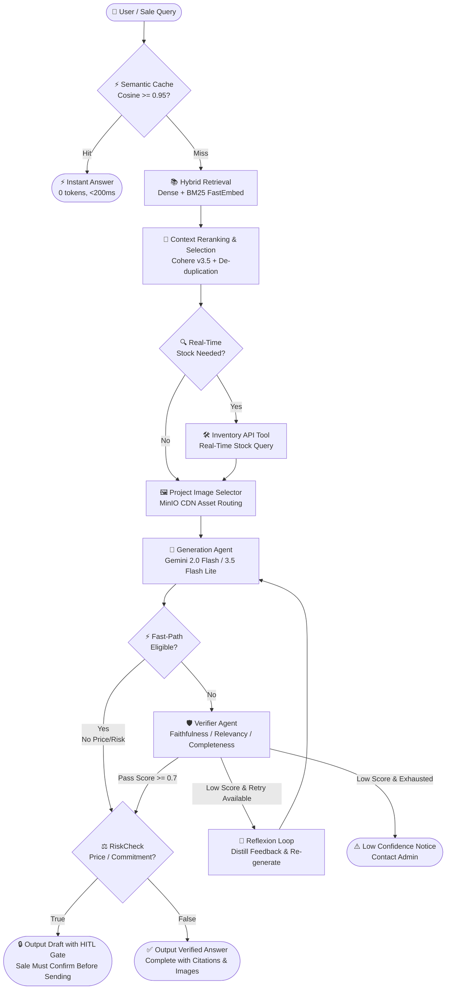

<div align="center">


### **AUREMONT AI AGENT**
**Enterprise Real-Estate Multi-Agent Sales & Consultation Platform**

*Instant RAG Grounding • Real-Time Inventory Function Calling • Self-Reflecting Verifier • Deterministic Human-in-the-Loop Risk Gate*

---

[](https://www.python.org/)
[](https://fastapi.tiangolo.com/)
[](https://react.dev/)
[](https://langchain-ai.github.io/langgraph/)
[](https://qdrant.tech/)
[](https://redis.io/)
[](https://www.mysql.com/)
[](https://www.docker.com/)

</div>

---

## 📌 Executive Overview

### The Real Estate Sales Challenge
Real-estate sales professionals and customer support agents face a high-stakes, fast-paced environment:
- **Massive, Fragmented Knowledge Base**: Hundreds of pages of project prospectuses, complex payment schedules, zoning legalities, and shifting discount policies across multiple documents (PDF, DOCX, XLSX).
- **High Consequence of Error**: Quoting an inaccurate price, invalid discount percentage, or outdated payment milestone can lead directly to contract disputes, brand damage, and financial liability.
- **Dynamic Inventory Churn**: Unit availability changes second-by-second on live internal databases — static RAG answers risk quoting units that are already reserved or sold.
- **Latency vs. Accuracy Tradeoff**: Sales reps in the field need verified answers in under 3 seconds while consulting clients live.

### The Auremont Solution
**Auremont** is an enterprise-grade AI Agent designed specifically for real-estate sales enablement and customer consultation. Built on a stateful **LangGraph** orchestration graph, Auremont combines semantic retrieval with real-time tool execution, dual-layer LLM verification with self-reflection, and a zero-hallucination **Human-in-the-Loop (HITL)** risk gate.

---

## 🏗 System Architecture & Pipeline

Auremont implements an intelligent, deterministic **Multi-Agent StateGraph**:



---

## 🌟 Key Capabilities & Technical Highlights

### 1. 🛡️ Dual-Agent Verification & Reflexion Self-Correction Loop
- **Independent Judge**: Every generated draft is evaluated by a dedicated Verifier Agent scoring three orthogonal dimensions: **Faithfulness** (grounded in context), **Answer Relevancy** (answers what was asked), and **Completeness** (covers all sub-questions).
- **Reflexion Retries (`MAX_GENERATE_RETRIES=1`)**: When a draft scores below threshold ($\tau = 0.7$), the Verifier's exact diagnosis (e.g., `"thiếu tiến độ đợt 2"`) is fed back into the prompt for a targeted, corrected re-generation.
- **Reflection Memory**: Defect patterns are distilled and stored in Redis (`reflection:lessons`) to inoculate future sessions against repeating identical mistakes.

### 2. ⚡ Deterministic Human-in-the-Loop (HITL) Safety Gate
- **Zero-Tolerance Regex Risk Classifier**: Evaluates answers with zero LLM overhead for financial units (`tỷ`, `triệu`, `VND`), raw numbers ($\ge 9$ digits), percentage discounts, and commitment phrasing (`đặt cọc`, `cam kết`, `tiến độ`, `sổ hồng`).
- **Sale Confirmation Flow**: When `requires_hitl = True`, the answer is locked behind an action card in the UI. The sales rep must review and click **Confirm** before figures can be copied or forwarded to a customer.

### 3. 🛠️ Live Inventory Function Calling
- Real-time stock queries (`"Còn căn 2PN nào không?"`) are routed directly via HTTP Function Calling to the inventory API rather than relying on static vector embeddings.
- **Intelligent Slug Mapping**: `INVENTORY_PROJECT_MAP` translates catalogue slugs (`the-palma`, `vinhomes-ocean-park`) to central inventory project IDs (`ocean-park-3`) with fallback safeguards and startup validations.

### 4. 🚀 Hybrid Retrieval & Fast-Path Latency Optimization
- **Dense + Sparse Search**: Combines semantic embeddings with local BM25 keyword matching (FastEmbed) via Reciprocal Rank Fusion (RRF).
- **Semantic Cache (`salesmate_qa_cache`)**: Frequently asked opening questions match vector cache at Cosine similarity $\ge 0.95$, returning instant answers in $<200\text{ms}$ at 0 LLM cost.
- **Fast-Path Latency Bypass**: Safe descriptive questions (amenities, location) without monetary commitments can skip the secondary Verifier call, bringing total response latency strictly within **1.5 – 2.5s**.

### 5. 👥 Dual-Audience RBAC & Document Visibility Quarantine
- **Role-Based Clearances**:
  - `INTERNAL`: Sales reps and Admins can query internal pricing policies, commission sheets, and unreleased documents.
  - `PUBLIC`: Customer chat strictly filters retrieval to public marketing material; answers are formulated in a polite, discovery-focused consultative tone.
- **Automated Anti-Injection & Ingestion Scanner**: Inspects uploaded documents (PDF, DOCX, XLSX) for malicious prompt injections, hidden text, and duplicate content before vectorization.

---

## 🛠️ Technology Stack

| Layer | Technology | Purpose |
| :--- | :--- | :--- |
| **Backend Core** | FastAPI • Python 3.11/3.12 • Pydantic v2 | High-performance async REST API, validation, dependency injection |
| **Orchestration** | LangGraph (`StateGraph`) | Stateful, cyclic multi-agent graph with conditional branching |
| **LLM & Embeddings** | Google Gemini (`gemini-2.0-flash` / `gemini-3.5-flash-lite`, `gemini-embedding-001`) | Fast reasoning, structured JSON outputs, high-dimensional vector embeddings |
| **Reranking** | Cohere Rerank v3.5 *(optional hosted cross-encoder)* | Precision context ranking & duplicate removal |
| **Vector DB** | Qdrant | Dense vector search, sparse BM25 payload storage, semantic QA cache |
| **Relational DB** | MySQL 8.4 LTS • SQLAlchemy 2.0 • Alembic | Structured relational storage (users, sessions, messages, audit logs) |
| **Memory & Cache** | Redis 7 Alpine *(AOF persistence, fail-open)* | Long-term user preferences, Reflection Memory, rate-limiting buckets |
| **Object Storage** | MinIO (S3-compatible) | Secure document storage, project image CDN caching |
| **Frontend SPA** | React 19 • Vite • TypeScript • Tailwind CSS • Lucide Icons | Responsive UI with separate Sale, Admin, and Public Customer chat modes |
| **Evaluation** | Custom Graders • Golden Regression Dataset • Pytest | Continuous quality evaluation, latency benchmarking, hallucination tracking |

---

## 🌐 Infrastructure & Ports

| Service | Container / Service | Port (Host) | Internal URL | Purpose |
| :--- | :--- | :--- | :--- | :--- |
| **Backend** | `ai20k_backend` | `8000` | `http://localhost:8000` | REST API, OpenAPI docs (`/docs`) |
| **Frontend** | `ai20k_frontend` | `5173` | `http://localhost:5173` | React 19 Client UI |
| **MySQL** | `ai20k_mysql` | `3307` | `localhost:3307` (Docker: `3306`) | Relational Database |
| **Qdrant** | `ai20k_qdrant` | `6333` | `http://localhost:6333` | Vector Database & Semantic Cache |
| **Redis** | `ai20k_redis` | `6379` | `redis://localhost:6379/0` | Memory & Lesson Storage |
| **MinIO API** | `ai20k_minio` | `9000` | `http://localhost:9000` | S3 Object Storage API |
| **MinIO Console** | `ai20k_minio` | `9001` | `http://localhost:9001` | MinIO Web Management Console |

---

## 🚀 Quick Start Guide

### Prerequisites
- [Docker Desktop](https://www.docker.com/products/docker-desktop/) (recommended for full-stack deployment)
- Node.js 20+ and Python 3.11+ (if running locally without Docker)
- A valid [Google Gemini API Key](https://aistudio.google.com/)

### 1. Clone & Configure
```bash
# Clone the repository
git clone https://github.com/AI20K-Build-Phase-Cohort-3/P-110.git
cd P-110

# Configure environment files
cp .env.example .env
cp frontend/.env.example frontend/.env
```

Open `.env` and fill in your keys:
```env
GEMINI_API_KEY=your_actual_gemini_api_key_here
SECRET_KEY=generate_a_secure_random_key_for_production
```

### 2. Launch with Docker Compose (Recommended)
```bash
# Start all 6 containerized services
docker compose up -d --build
```
> Database migrations, schema seeding, and default demo accounts are automatically applied on startup!

- **Sale / Customer App**: `http://localhost:5173`
- **Swagger API Docs**: `http://localhost:8000/docs`
- **Default Accounts**:
  - **Sale User**: `sale_test` / `pass1234`
  - **Admin User**: `admin_test` / `pass1234`

### 3. Local Development Setup (Without Docker)
```bash
# 1. Setup Python Virtual Environment
python -m venv .venv
.venv\Scripts\activate      # On Windows
# source .venv/bin/activate # On Linux/macOS

# 2. Install dependencies
pip install -r requirements.txt

# 3. Apply database migrations (falls back to local SQLite data/app.db)
alembic upgrade head

# 4. Start backend server
uvicorn backend.main:app --reload --port 8000

# 5. Start frontend (in a separate terminal)
cd frontend
npm install
npm run dev
```

---

## 📂 Repository Structure

```text
P-110/
├── assets/                    # Project logos, architectural diagrams, screenshots
├── backend/
│   ├── ai/                    # Prompt engineering, citations, intent classification
│   ├── core/                  # Configuration, database engines, security, rate limiting
│   ├── models/                # SQLAlchemy ORM models (User, Session, Message, Audit)
│   ├── schemas/               # Pydantic schemas for request/response serialization
│   ├── repositories/          # Abstracted data-access layer (Session, Message, Document)
│   ├── services/              # Core business services:
│   │   ├── agent_pipeline.py  # LangGraph Multi-Agent Orchestrator
│   │   ├── verifier_service.py# Independent 3-axis LLM judge & feedback generator
│   │   ├── risk_service.py    # Deterministic price & commitment detector
│   │   ├── rag_service.py     # Hybrid retrieval, context selection, chunking
│   │   ├── cache_service.py   # Semantic QA vector cache in Qdrant
│   │   ├── reflection_memory.py # Self-correction lesson storage in Redis
│   │   └── inventory_service.py # Live stock API client with slug mapping
│   ├── routers/               # FastAPI route controllers (Auth, Sale, Customer, Admin, HITL)
│   └── main.py                # Application entrypoint and lifespan management
├── frontend/                  # React 19 + Vite SPA (Sale, Admin, Customer interfaces)
├── migrations/                # Alembic database schema migrations
├── eval/                      # Evaluation suite, golden dataset, LLM grading runners
├── tests/                     # 75+ automated unit, integration, and regression tests
├── docs/                      # Comprehensive developer guides, conflict resolution specs
└── docker-compose.yml         # Production-parity 6-container development stack
```

---

## 🧪 Testing & Quality Assurance

Auremont maintains strict test coverage across all critical pipeline components:

```bash
# Run unit & service tests (no Docker needed, mocked dependencies)
pytest tests/test_services tests/test_api -v

# Run inventory & reflexion verification tests specifically
pytest tests/test_services/test_inventory_service.py tests/test_services/test_agent_pipeline_reflexion.py -v

# Run full golden regression gate
pytest tests/test_services/test_golden_regression.py -v

# Format and lint code
ruff check . && ruff format --check .
```

---

## 👥 Project Team

| Name | Role | Responsibilities |
| :--- | :--- | :--- |
| [Team Member Name] | [Role] | [Responsibilities / Focus Area] |
| [Team Member Name] | [Role] | [Responsibilities / Focus Area] |
| [Team Member Name] | [Role] | [Responsibilities / Focus Area] |
| [Team Member Name] | [Role] | [Responsibilities / Focus Area] |

---

## 🤝 Contributing

Setup, the four checks CI runs, and the parts of the pipeline that need care are in
[CONTRIBUTING.md](CONTRIBUTING.md). Security policy and secret handling are in
[SECURITY.md](SECURITY.md).

---

## 📄 License & Acknowledgments

This project is licensed under the [**MIT License**](LICENSE). Developed as part of the **AI20K Build Phase (Cohort 3)**. Special thanks to the instructors and mentors for technical guidance on multi-agent architectures and enterprise RAG standards.

